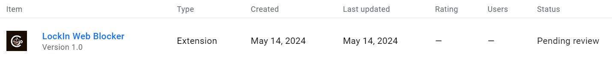

# Coffee Web Blocker Chrome Extension (React, TypeScript, Webpack, Chrome API)


By: Shruti Agarwal, Tiana Costello, Minfei Shen, and Eric Zou

Coffee Web Blocker is a Chrome Extension that enables users to group and block sets of websites (i.e. block lists), in order to boost their productivity while working. Our platform offers an intuitive way for users to activate blocking sessions and manage blocklists/associated URLs.

## Our Awesome Features

- Users can create customizable lists of websites to block
- Users can activate groups of list to block in the same blocking session
- Users can temporarily bypass the blocking of a website during a session if needed
- Users add specific URL or the whole domain to a blocklist
- Users can easily create, update, and delete their blocklists via the advanced settings page

Visit our [landing page](https://coffeewebblocker.click/) here.
See a [demo](https://youtu.be/NvZ-1hMQ5A0) here.

## Installation

### Install From Release

- Download the latest release from the [Releases](https://github.com/ezou626/coffee-web-blocker/releases)
- Unzip the downloaded ZIP file
- Open Chrome and navigate to `chrome://extensions`
- Enable "Developer mode"
- Drag and drop the unzipped folder into the extensions page

### Install From Source

1. Clone the repository:

   ```bash
   git clone https://github.com/ezou626/coffee-web-blocker/releases
   ```

2. Install dependencies:

   ```bash
   cd coffee-web-blocker
   yarn install
   ```

3. Build the extension:

   ```bash
   yarn run build
   ```

4. Load the extension in Chrome:

   - Open Chrome and navigate to `chrome://extensions`
   - Enable "Developer mode"
   - Click "Load unpacked" and select the `dist` directory from the project
   
## Development

- Run the development server with hot reloading:

  ```bash
  yarn run dev
  ```

- Load the unpacked extension in Chrome from the `dev_dist` directory
- Make changes to the source code and the extension will automatically reload

## Issues

Please let us know about any issues you encounter [here](https://github.com/ezou626/coffee-web-blocker/issues).

## Demo Instruction and Screenshots

- Navigate to a new tab

### Popup Demo
- Click on the extension icon to open the popup window

- Under "Start A New Session" in the popup, you can start a new session by selecting one or more lists from the "Search Lists" dropdown and clicking on block.
- Once a blocking session start, you can easily end the session by clicking on "End Blocking Session" button.
- Under "Add Current Tab To List", the URL of the active tab is displayed. You can add this URL or the domain of this URL to a list chosen from the dropdown.

### Setting Page Demo
- Click on "Advanced Settings" to open the setting page.

- On the setting page, you can easily create a new block lists, or delete existing block lists by clicking the 'x' next to each of them.
- Clicking on each individual list would bring you to their respective editing page.

- In the editing page, you can add URL and domain to that list, as well as view all existing URL/domains in that list and deleting them as needed.

### Blocking Demo
- Once a blocking session start, all URL and domains in the selected lists for that session will be blocked

- You can temporarily bypass blocking by clicking "Unblock for Now"

## Chrome Extension Architecture

This project follows the Manifest V3 architecture for Chrome extensions. Key components of the architecture include:

- `manifest.json`: Defines the extension's metadata, permissions, and script configurations
- `background.js`: Runs in the background and handles events and long-running tasks
- Popup window: Displays the extension's user interface when the extension icon is clicked
- Advanced Settings Page: Displays editing and updating features of blocklists

### Storage
- IndexedDB
- Local Storage

### Monitoring
- Service Worker

## Chrome Web Store Status


## Credits

https://github.com/machadop1407he blocking page animation of this project was set up from the tutorial by [Pedro Henrique Machado](https://github.com/Harshita-mindfire) on creating a social media blocker. The repo is linked [here](https://github.com/machadop1407/SocialMediaBlocker-ChromeEXT)

Our project forked Professor [Lumbroso](https://github.com/jlumbroso/chrome-extension-text-collector)'s repository as a base, changing to ECMAScript 6.
